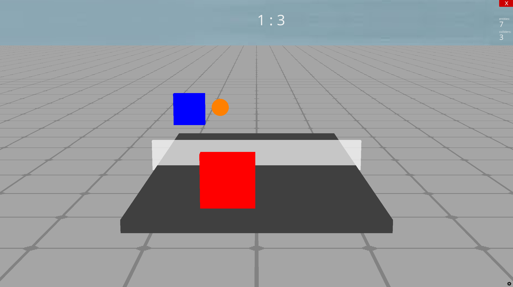

# PingPong3DRealistic V1.3.1 🏓

 

⚡ **A realistic 3D ping-pong simulation in Python using Ursina and NumPy**

PingPong3DRealistic is a 3D table tennis simulation focusing on **realistic ball physics**, spin, and AI behavior.  

> **Warning:** The game is quite challenging! 😅  
> The difficulty comes from realistic ball physics, spin (topspin/backspin/sidespin), air drag, and AI behavior.  
> The AI is not perfect but requires reflexes and prediction to beat.

---

## 🎮 Controls

- Move your paddle with the **mouse**: X axis = left/right, Y axis = up/down  
- Objective: hit the ball so the AI cannot return it  
- Game ends when a player reaches **7 points**

---

## ⚙️ Requirements and Installation

### Python
1. Install Python 3.10+  
2. Install the required packages:

pip install ursina numpy pillow
